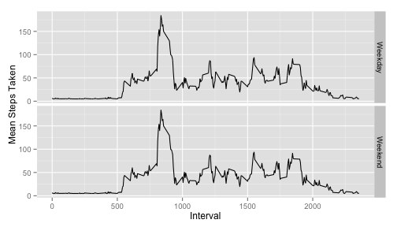

---
MKarp
title: "Reproducible Research: Peer Assessment 1"
output: 
html_document:
keep_md: true
---


## Loading and preprocessing the data

```r
activity_data = read.csv("activity.csv")
# inspect acitivity data
str(activity_data)
```

```
## 'data.frame':	17568 obs. of  3 variables:
##  $ steps   : int  NA NA NA NA NA NA NA NA NA NA ...
##  $ date    : Factor w/ 61 levels "2012-10-01","2012-10-02",..: 1 1 1 1 1 1 1 1 1 1 ...
##  $ interval: int  0 5 10 15 20 25 30 35 40 45 ...
```

```r
# convert date variable into date object
activity_data$date = as.character(activity_data$date)
activity_data$date = as.Date(activity_data$date)
str(activity_data)
```

```
## 'data.frame':	17568 obs. of  3 variables:
##  $ steps   : int  NA NA NA NA NA NA NA NA NA NA ...
##  $ date    : Date, format: "2012-10-01" "2012-10-01" ...
##  $ interval: int  0 5 10 15 20 25 30 35 40 45 ...
```

```r
summary(activity_data)
```

```
##      steps             date               interval     
##  Min.   :  0.00   Min.   :2012-10-01   Min.   :   0.0  
##  1st Qu.:  0.00   1st Qu.:2012-10-16   1st Qu.: 588.8  
##  Median :  0.00   Median :2012-10-31   Median :1177.5  
##  Mean   : 37.38   Mean   :2012-10-31   Mean   :1177.5  
##  3rd Qu.: 12.00   3rd Qu.:2012-11-15   3rd Qu.:1766.2  
##  Max.   :806.00   Max.   :2012-11-30   Max.   :2355.0  
##  NA's   :2304
```

## What is mean total number of steps taken per day?

```r
#histogram of steps
step_hist <- hist(activity_data$steps)
```

 

```r
## Calculate and report the mean and median total number of steps taken per day
mu_steps <- mean(activity_data$steps, na.rm = TRUE)
mu_steps
```

```
## [1] 37.3826
```

```r
# 37.3826

median_steps <- median(activity_data$steps, na.rm = TRUE)
median_steps
```

```
## [1] 0
```

```r
# 0
```

## What is the average daily activity pattern?

```r
# table of means of steps taken per interval
mean_step_interval <- tapply(activity_data$steps, activity_data$interval, mean, na.rm = TRUE)
# plot of activity
plot_ts <- plot(type = 'l', as.numeric(names(mean_step_interval)), mean_step_interval, xlab = "Interval", ylab = "Mean Steps Taken")
```

 

```r
# Which 5-minute interval, on average across all the days in the dataset, contains the maximum number of steps?
max_avg_steps_taken <- which.max(mean_step_interval)
max_avg_steps_taken
```

```
## 835 
## 104
```

```r
mean_step_interval[104]
```

```
##      835 
## 206.1698
```

## Imputing missing values

```r
# Calculate and report the total number of missing values in the dataset (i.e. the total number of rows with NAs)
num_na <- sum(is.na(activity_data))
num_na
```

```
## [1] 2304
```

```r
# only steps taken has missing values so we replace these with the mean
summary(activity_data)
```

```
##      steps             date               interval     
##  Min.   :  0.00   Min.   :2012-10-01   Min.   :   0.0  
##  1st Qu.:  0.00   1st Qu.:2012-10-16   1st Qu.: 588.8  
##  Median :  0.00   Median :2012-10-31   Median :1177.5  
##  Mean   : 37.38   Mean   :2012-10-31   Mean   :1177.5  
##  3rd Qu.: 12.00   3rd Qu.:2012-11-15   3rd Qu.:1766.2  
##  Max.   :806.00   Max.   :2012-11-30   Max.   :2355.0  
##  NA's   :2304
```

```r
str(activity_data)
```

```
## 'data.frame':	17568 obs. of  3 variables:
##  $ steps   : int  NA NA NA NA NA NA NA NA NA NA ...
##  $ date    : Date, format: "2012-10-01" "2012-10-01" ...
##  $ interval: int  0 5 10 15 20 25 30 35 40 45 ...
```

```r
imputed_activity_data <- activity_data
imputed_activity_data$steps[is.na(imputed_activity_data$steps)] <- mean(imputed_activity_data$steps, na.rm = TRUE)
str(imputed_activity_data)
```

```
## 'data.frame':	17568 obs. of  3 variables:
##  $ steps   : num  37.4 37.4 37.4 37.4 37.4 ...
##  $ date    : Date, format: "2012-10-01" "2012-10-01" ...
##  $ interval: int  0 5 10 15 20 25 30 35 40 45 ...
```

```r
summary(imputed_activity_data)
```

```
##      steps             date               interval     
##  Min.   :  0.00   Min.   :2012-10-01   Min.   :   0.0  
##  1st Qu.:  0.00   1st Qu.:2012-10-16   1st Qu.: 588.8  
##  Median :  0.00   Median :2012-10-31   Median :1177.5  
##  Mean   : 37.38   Mean   :2012-10-31   Mean   :1177.5  
##  3rd Qu.: 37.38   3rd Qu.:2012-11-15   3rd Qu.:1766.2  
##  Max.   :806.00   Max.   :2012-11-30   Max.   :2355.0
```

## Are there differences in activity patterns between weekdays and weekends?

```r
imputed_activity_data$weekday_bool <- weekdays(imputed_activity_data$date) == "Saturday" | weekdays(imputed_activity_data$date) == "Sunday"
levels(imputed_activity_data$weekday_bool) <- c("Weekday", "Weekend")
imputed_activity_data$weekday_bool[imputed_activity_data$weekday_bool == TRUE] <- "Weekend" 
imputed_activity_data$weekday_bool[imputed_activity_data$weekday_bool == FALSE] <- "Weekday" 

library(ggplot2)
imputed_activity_data$mean_step_interval <- tapply(imputed_activity_data$steps, imputed_activity_data$interval, mean)
# plot of activity
activity_plot <- ggplot(data = imputed_activity_data, aes(x = interval, y = mean_step_interval)) + geom_line() + xlab("Interval") + ylab("Mean Steps Taken")
activity_plot + facet_grid(weekday_bool~.)
```

 

```r
library(knitr)
```

